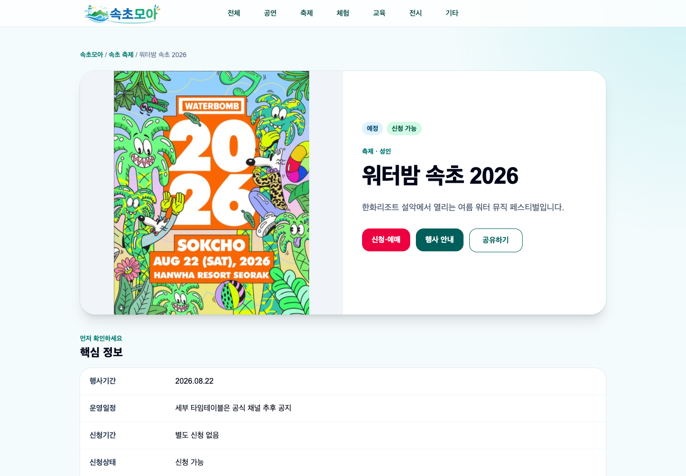
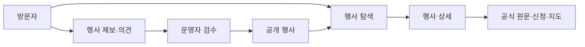
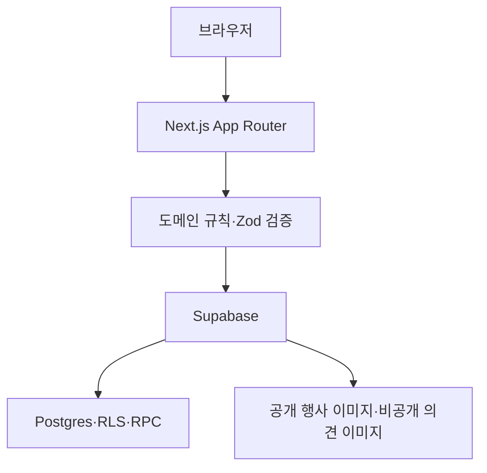
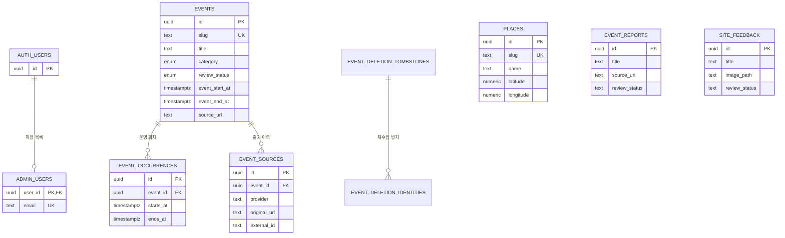

# 속초모아

속초모아는 속초의 공연·축제·체험·교육·전시 정보를 한곳에서 탐색하는 지역 행사 서비스입니다.

행사 정보를 공식 원문과 함께 정리하고, 날짜·장소·요금·신청 상태를 비교하기 쉽게 보여줍니다.

- 서비스: [sokcho-moa.vercel.app](https://sokcho-moa.vercel.app/)

## 기술 스택

Next.js App Router, React, TypeScript, Tailwind CSS, Supabase, Zod, Vitest, Playwright, Vercel, Google Analytics 4 (GA4)

## 화면

<p align="center">
  
  
</p>
<p align="center">
  <sub>홈에서 행사를 찾고, 상세 화면에서 공식 안내·신청·지도 정보를 이어서 확인할 수 있습니다.</sub>
</p>

## 문제 정의

속초의 행사 정보는 시청, 문화기관, 관광시설, 예매처와 여러 공식 채널에 나뉘어 올라옵니다.

사용자는 행사마다 날짜, 장소, 요금, 신청 방법을 여러 페이지에서 다시 확인해야 합니다. 이미 종료되었거나 신청이 마감된 행사를 뒤늦게 발견하는 문제도 있습니다.

속초모아는 흩어진 정보를 행사 단위로 다시 묶어 다음 질문에 빠르게 답하도록 만들었습니다.

- 오늘 또는 가까운 날짜에 어떤 행사가 있는가?
- 어디에서 열리고, 누구를 대상으로 하는가?
- 무료인가, 신청이 필요한가?
- 공식 안내와 신청 페이지는 어디에 있는가?

## 해결 방식

서비스의 핵심 단위는 행사입니다.

행사 목록에서 카테고리와 상태를 좁히고, 검색·정렬로 후보를 비교한 뒤, 상세 화면에서 공식 원문과 주변 정보를 확인하는 흐름으로 구성했습니다.

### 방문자 기능

- 공연·축제·체험·교육·전시·기타 카테고리 탐색
- 행사명·장소·기관 검색
- 진행 중·예정·마감 행사 구분
- 게시순·행사일순·신청 마감일순·조회순 정렬
- 행사 기간, 운영 회차, 신청 상태, 대상, 요금, 장소 확인
- 공식 행사 안내·신청·예매 페이지와 네이버 지도 연결
- 행사 캘린더, 주변 명소, 관련 행사 탐색
- 행사 제보와 서비스 의견 접수

### 운영자 기능

- Supabase Auth와 관리자 허용 목록을 함께 사용하는 로그인
- 행사와 주변 명소 등록·수정·검수·공개·반려·삭제
- 여러 운영 회차와 대표 이미지 관리
- `EventCandidate` JSON 수집 결과를 검수 대기열로 가져오기
- 행사 제보와 서비스 의견 검토
- 삭제한 행사의 자동 재수집 방지

## 데이터 흐름



Next.js 서버 컴포넌트가 공개 행사를 조회하고, 서버 액션이 제보·의견과 관리자 쓰기를 처리합니다. Supabase는 Postgres, Auth, Storage, Row Level Security (RLS)를 담당합니다.



## 데이터 모델



행사 상태는 저장된 상태값을 중복하지 않고 행사 일정과 신청 기간에서 계산합니다. 운영 회차는 `event_occurrences`에 구조화하고, 공식 출처 변경은 `event_sources`에 기록합니다.

## 코드베이스 구조

```text
app/                    # 공개·관리자 페이지, API, 메타데이터
components/             # 공용 UI와 관리자 UI
lib/domain/             # 순수 도메인 규칙과 검증
lib/data/               # 공개 조회, 매퍼, 캐시, 데모 데이터
lib/actions/            # 서버 액션과 쓰기 진입점
lib/admin/              # 관리자 인증, 폼 스키마, 쓰기 도우미
lib/security/           # 공개 제출 요청 제한
lib/supabase/           # 서버·브라우저·service-role 클라이언트
data/                   # 검증된 명소 원본 데이터
supabase/migrations/    # 스키마, RLS, RPC
tests/                  # 단위·통합·E2E 테스트
```

## 로컬 실행

Node.js 22와 pnpm 9를 사용합니다.

```bash
pnpm install
cp .env.example .env.local
pnpm dev
```

기본 `demo` 모드는 자격증명 없이 샘플 행사를 보여줍니다. Supabase 데이터를 사용하려면 `.env.local`에 환경 변수를 입력하고 `NEXT_PUBLIC_DATA_MODE=supabase`로 변경합니다.

서버 전용 환경 변수에는 `NEXT_PUBLIC_` 접두사를 붙이지 않습니다. 실제 값은 `.env.local`과 배포 환경에만 저장합니다.

## 검증

```bash
pnpm lint
pnpm typecheck
pnpm test
pnpm places:check
pnpm test:e2e
pnpm build
```

## 공개 데이터와 라이선스

소스 코드는 [MIT License](./LICENSE)로 배포합니다.

외부 기관의 행사·명소 데이터, 제3자 이미지·로고는 MIT License에 포함하지 않습니다. 각 원출처의 이용 조건과 출처표시 요구사항을 따릅니다.

