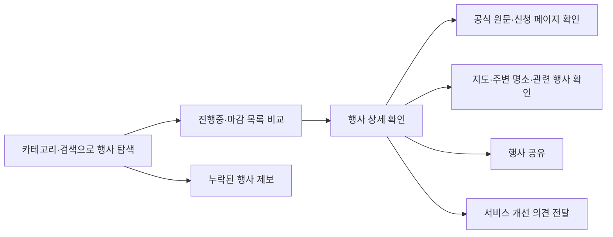
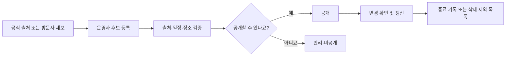
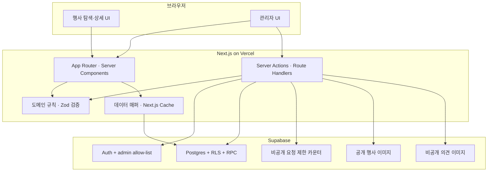
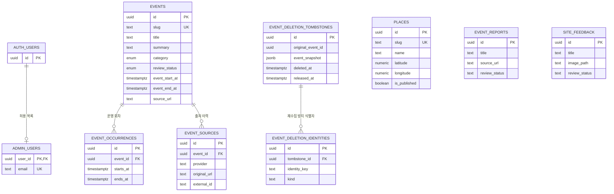

# 속초모아

> 요즘 속초에서 뭐 하지?

속초모아는 여러 기관과 채널에 흩어진 속초의 공연·축제·체험·교육·전시 정보를 한곳에서 찾도록 돕는 지역 행사 탐색 서비스입니다. 운영자가 공식 출처를 확인한 정보만 공개하고, 방문자는 일정·장소·신청 정보와 주변 명소를 한 흐름에서 살펴볼 수 있습니다.

[서비스 바로가기](https://sokcho-moa.vercel.app/)

> 속초모아는 행사를 소개하는 탐색 서비스이며 주최 기관의 공식 안내를 대신하지 않습니다. 방문하거나 신청하기 전에 반드시 행사 상세의 원문을 다시 확인해 주세요.

## 왜 만들었나요?

속초의 행사 정보는 시청, 문화기관, 관광시설과 각종 SNS에 나뉘어 올라옵니다. 주민과 여행자는 여러 페이지를 오가며 날짜, 신청 기간, 대상과 장소를 직접 비교해야 하고, 이미 마감된 정보를 뒤늦게 발견하기도 합니다.

속초 시민이 겪은 이 탐색의 불편을 줄이기 위해 시작했습니다. 더 많은 정보를 무조건 모으기보다, 출처가 분명한 정보를 사람이 검수하고 핵심 내용을 비교하기 쉽게 전달하는 것을 우선합니다.

### 주요 대상

- 오늘과 가까운 시일에 참여할 행사를 찾는 속초 주민
- 가족·아이와 함께할 공연, 체험, 교육 프로그램을 찾는 보호자
- 여행 일정에 행사와 주변 명소를 함께 넣고 싶은 방문객
- 공식 행사 정보를 더 잘 전달하고 싶은 지역 기관과 운영자

행사 탐색의 중심 범위는 속초입니다. 주변 명소 데이터는 행사 전후 이동을 돕기 위해 속초·고성·양양까지 포함할 수 있습니다.

## 서비스 흐름



운영 정보는 아래 검수 흐름을 거칩니다.



## 현재 제공하는 기능

### 방문자

- 공연, 축제, 체험, 교육, 전시, 기타 카테고리 탐색
- 행사명·소개·장소·출처 기관 통합 검색
- 진행중 행사와 마감 행사 구분
- 게시순, 행사일순, 신청 마감일순, 조회순 정렬
- 행사 기간, 실제 운영 회차, 신청 상태, 대상, 요금, 주최·문의 정보 확인
- 공식 행사 안내, 신청·예매 페이지, 네이버 지도 연결
- 위치 기반 주변 명소와 기간·대상이 비슷한 행사 추천
- 링크 공유, 행사 제보, 서비스 의견 및 선택적 이미지 첨부
- 검색 엔진용 메타데이터, 사이트맵, 구조화 데이터 제공

### 운영자

- Supabase Auth와 `admin_users` 허용 목록을 함께 사용하는 관리자 인증
- 행사 등록·수정·검수·공개·반려·비공개·삭제
- 연속 일정과 여러 운영 회차 관리
- 행사 대표 이미지와 주변 명소 관리
- 수집 결과를 `EventCandidate` JSON으로 가져와 검수 대기열에 등록
- 행사 제보와 서비스 의견 검토
- 삭제한 행사가 자동 수집으로 다시 생기지 않도록 제외 이력 관리

### 정보 신뢰 원칙

- 행사별 공식 원문 URL이 있는 정보만 등록합니다.
- 운영자가 검수하고 공개한 행사만 방문자 화면에 노출합니다.
- 확인할 수 없는 값은 추측해서 채우지 않습니다.
- 출처와 마지막 확인 날짜를 함께 관리합니다.
- 행사·신청 상태는 별도 상태값을 중복 저장하지 않고 일정에서 계산합니다.
- 자동 수집 결과도 운영자 검수 전에는 공개하지 않습니다.

## 아키텍처

Next.js App Router의 서버 컴포넌트를 기본 경계로 사용합니다. 공개 데이터 조회는 서버에서 캐시하고, 브라우저에는 검색·정렬·공유처럼 상호작용에 필요한 코드만 보냅니다. 방문자 제보·의견은 익명 Data API 쓰기를 닫고 검증된 서버 액션이 service-role로 저장합니다. 이때 원본 IP 대신 HMAC 값만 사용하는 DB 카운터가 폼별 요청 수를 원자적으로 제한합니다. 관리자 쓰기는 Auth·허용 목록·RLS를 확인하고, 여러 테이블 변경은 트랜잭션 RPC로 실행합니다.



### 책임 경계와 SSOT

| 경계 | 책임 |
| --- | --- |
| `app` | URL, 페이지 조합, 메타데이터, 로딩·오류 경계 |
| `components` | 화면 표현과 사용자 상호작용 |
| `lib/domain` | 프레임워크와 분리된 상태 계산, 필터, 검증 규칙 |
| `lib/data` | 공개 조회, Supabase 행 매핑, 캐시 정책 |
| `lib/actions` | 서버 쓰기 진입점과 오류 반환 |
| `lib/security` | 공개 제출 요청 제한과 서버 전용 보안 경계 |
| `lib/admin` | 관리자 인증, 폼 스키마, DB 쓰기 입력 변환 |
| `supabase/migrations` | 스키마, 제약조건, RLS, 원자적 RPC의 최종 정의 |

중복된 진실을 만들지 않도록 다음 값을 한곳에서 관리합니다.

- 행사 소개의 쓰기 기준은 `events.summary`이며 `description`은 이전 데이터 호환용 읽기 fallback입니다.
- 카테고리·대상 값과 라벨은 도메인 taxonomy가 기준입니다.
- 진행·마감·신청 상태는 행사 및 신청 날짜에서 파생합니다.
- 여러 회차 일정은 `event_occurrences`가 구조화해 보관합니다.
- 관리자 상태 변경과 관계 데이터 갱신은 가능한 한 하나의 DB 트랜잭션에서 처리합니다.

이 규모에서 필요하지 않은 repository/service 계층은 추가하지 않았습니다. 외부 데이터 소스가 늘거나 동일한 규칙을 여러 실행 환경에서 공유해야 할 때만 새 추상화를 도입합니다.

## 디렉터리 구조

```text
.
├── app/                    # 공개·관리자 페이지, API, 로딩·오류 경계
├── components/             # 공용 UI와 관리자 UI
│   ├── admin/
│   └── analytics/
├── lib/
│   ├── actions/            # 서버 액션
│   ├── admin/              # 관리자 인증·스키마·쓰기 도우미
│   ├── analytics/          # 분석 이벤트 경계
│   ├── config/             # 환경 변수 검증
│   ├── data/               # 조회·캐시·DB 행 매핑·데모 데이터
│   ├── domain/             # 순수 도메인 타입과 규칙
│   ├── seo/                # 구조화 데이터와 메타데이터
│   ├── security/           # 공개 제출 요청 제한
│   └── supabase/           # 서버·브라우저·service-role 클라이언트
├── data/                   # 검증된 명소 생성 원본
├── public/                 # 정적 이미지
├── scripts/                # 명소 데이터 생성·검증
├── supabase/
│   ├── migrations/         # 순서대로 적용하는 DB 변경
│   ├── rollbacks/          # 운영 복구 참고 SQL
│   ├── snippets/           # 운영 점검용 SQL
│   └── seed.sql            # 선택적 명소·샘플 데이터
└── tests/
    └── e2e/                # Playwright 사용자 흐름 테스트
```

완성되지 않은 모바일 앱, 로컬 검토 결과, 테스트 출력과 개인 작업 문서는 공개 저장소 범위에서 제외합니다. 현재 제품은 반응형 웹을 단일 배포 대상으로 삼습니다.

## 데이터 모델



`event_reports`, `site_feedback`, `places`는 행사와 생명주기가 달라 의도적으로 직접 FK를 두지 않습니다. 삭제 이력의 `original_event_id`도 이미 삭제된 행을 기록하므로 FK가 아닌 감사 값입니다. 의견 이미지와 `site_feedback.image_path`의 연결은 Storage 경로를 통한 논리적 관계입니다.

## 기술 구성

| 영역 | 기술 |
| --- | --- |
| 웹 | Next.js 16 App Router, React 19, TypeScript |
| 스타일 | Tailwind CSS 4 |
| 데이터·인증·파일 | Supabase Postgres, Auth, Storage, RLS |
| 입력 검증 | Zod 4, Postgres 제약조건 |
| 테스트 | Vitest, Playwright |
| 배포 | Vercel, GitHub Actions |

공개 목록은 서버에서 렌더링하고 5분 단위로 캐시합니다. 행사 상세와 사이트맵은 ISR을 사용하며, 운영자 쓰기 작업이 성공하면 관련 캐시 태그와 경로를 갱신합니다.

## 로컬 실행

Node.js 22와 pnpm 9가 필요합니다.

```bash
pnpm install
cp .env.example .env.local
pnpm dev
```

브라우저에서 `http://localhost:3000`을 엽니다. 기본 `demo` 모드는 자격증명 없이 화면을 확인할 수 있도록 샘플 행사를 표시합니다. 샘플은 실제 운영 정보가 아닙니다.

## 환경 변수

`.env.example`을 `.env.local`로 복사한 뒤 실행 환경에 맞게 값을 입력합니다.

| 이름 | 용도 | 브라우저 공개 |
| --- | --- | --- |
| `NEXT_PUBLIC_DATA_MODE` | `demo` 또는 `supabase` 데이터 모드 | 예 |
| `NEXT_PUBLIC_SITE_URL` | canonical URL, 사이트맵, robots 기준 주소 | 예 |
| `NEXT_PUBLIC_SUPABASE_URL` | Supabase 프로젝트 URL | 예 |
| `NEXT_PUBLIC_SUPABASE_PUBLISHABLE_KEY` | RLS가 적용되는 publishable key | 예 |
| `SUPABASE_SERVICE_ROLE_KEY` | 서버 전용 행사 제보·의견 접수, 비공개 이미지 업로드·수집 작업 | 아니요 |
| `SUBMISSION_RATE_LIMIT_HMAC_SECRET` | 원본 IP를 저장하지 않는 공개 제출 요청 제한 키 | 아니요 |
| `REVALIDATE_SECRET` | 외부 수집기의 캐시 갱신 요청 인증값 | 아니요 |

서버 전용 값에는 `NEXT_PUBLIC_` 접두사를 붙이지 마세요. 요청 제한 키는 `openssl rand -hex 32`처럼 독립된 무작위 값으로 만들고 다른 자격증명과 재사용하지 않습니다. `.env*`는 예시 파일을 제외하고 Git에서 무시합니다.

## Supabase 설정

1. 새 Supabase 프로젝트를 만듭니다.
2. Supabase CLI로 프로젝트를 연결하고 `supabase migration list`를 확인한 뒤 `supabase db push`로 마이그레이션을 적용합니다.
3. Authentication에서 이메일·비밀번호 운영자를 만듭니다.
4. 생성된 사용자 ID와 이메일을 `public.admin_users`에 등록합니다.
5. `.env.local`에 Supabase URL과 publishable key를 넣고 `NEXT_PUBLIC_DATA_MODE=supabase`로 바꿉니다.
6. `/admin/login`에서 로그인해 행사와 명소를 관리합니다.

```sql
insert into public.admin_users (user_id, email)
values ('00000000-0000-0000-0000-000000000000', 'operator@example.com');
```

`supabase/seed.sql`에는 화면과 주변 명소 기능을 확인하기 위한 데이터가 들어 있습니다. 실제 운영 DB에는 내용을 검토한 뒤 필요한 경우에만 적용하세요. 마이그레이션은 빈 DB에서도 적용 가능하며, 운영 데이터 보정 검사는 데이터가 존재할 때만 엄격하게 수행됩니다.

## 개발과 검증

```bash
pnpm lint          # 정적 분석
pnpm typecheck     # TypeScript 타입 검사
pnpm test          # Vitest 단위·통합 테스트
pnpm places:check  # 생성된 명소 자산 일치 확인
pnpm test:e2e      # 데스크톱·모바일 사용자 흐름
pnpm build         # 프로덕션 빌드
```

GitHub Actions도 같은 품질 검사를 `demo` 모드에서 실행합니다. 테스트 전용 경로는 운영 빌드에서 `404`로 차단하며 `robots.txt`에서도 수집을 막습니다.

## 배포와 운영 확인

Vercel에서 저장소를 가져온 뒤 Production 환경 변수를 등록합니다. 운영에서는 `NEXT_PUBLIC_DATA_MODE=supabase`와 실제 서비스 주소를 사용합니다.

배포 후에는 다음을 확인합니다.

1. 공개 목록과 카테고리 페이지가 실제 공개 행사만 보여주는지 확인합니다.
2. 행사 상세의 원문, 신청, 지도, 공유 링크를 확인합니다.
3. `/sitemap.xml`과 `/robots.txt`를 확인합니다.
4. 운영자 로그인과 행사 등록·수정·상태 변경을 확인합니다.
5. 공개 상태 변경 후 방문자 화면의 캐시가 갱신되는지 확인합니다.
6. 행사 제보와 의견 첨부 이미지가 관리자에게만 보이는지 확인합니다.
7. `/manifest.webmanifest`와 `/indexnow-key.txt`가 정상 응답하는지 확인합니다.
8. Google Search Console과 네이버 서치어드바이저에 운영 주소를 등록하고 `/sitemap.xml`을 제출합니다.
9. 홈, 주요 주제 페이지, 대표 행사 상세의 URL 검사를 실행한 뒤 한 번씩 재수집을 요청합니다.

공개 행사를 저장하거나 공개 상태를 변경·삭제하면 속초모아는 홈, 해당 주제와 행사 상세 URL의 변경을 네이버 IndexNow에 자동으로 알립니다. IndexNow는 빠른 재방문을 돕지만 색인이나 검색 순위를 보장하지는 않습니다.

## 보안과 공개 저장소 원칙

- 익명 Data API 쓰기는 차단합니다. 공개 제출은 Zod로 검증한 서버 액션이 service-role로 저장하고 DB 제약조건이 다시 제한합니다. service-role은 RLS를 우회하므로 서버 액션 자체가 보안 경계입니다.
- 관리자 작업은 로그인만으로 허용하지 않고 `admin_users` 허용 목록을 확인합니다.
- 관리자 여러 테이블 쓰기는 RPC 트랜잭션으로 묶어 부분 저장을 방지합니다.
- 행사 이미지는 공개 버킷, 의견 이미지는 관리자 전용 비공개 버킷으로 분리하고 업로드는 모두 3MB로 제한합니다.
- 외부 URL은 `http`와 `https`만 허용합니다.
- 공개 제보는 IP당 10분 10회, 서비스 의견은 10분 5회로 제한합니다. 원본 IP는 저장하거나 기록하지 않고 서버 전용 키로 만든 HMAC만 비공개 스키마에 잠시 보관합니다.
- 허니팟과 요청 제한을 기본 방어로 사용하고, 여러 IP에 분산된 스팸이 실제로 관측될 때 Turnstile 같은 CAPTCHA를 추가합니다.
- 생성 결과, 로컬 검토 문서, 미완성 앱과 환경 변수 파일은 `.gitignore`로 제외합니다.

공개 전에는 현재 파일뿐 아니라 Git 이력도 별도로 비밀정보 검사해야 합니다. 이미 커밋된 값이나 개인 정보는 `.gitignore`만으로 사라지지 않으므로 필요하면 새 공개 저장소를 만들거나 합의된 이력 정리 절차를 사용하세요.

## 프로젝트 범위와 다음 단계

현재 우선순위는 정확한 지역 행사 데이터와 검수 효율입니다.

- 공식 출처 기반 후보 수집과 변경 감지
- 오래된 정보 재검증 알림
- 운영자 검수 대기열 개선
- 공개 제출 제한 지표 관찰과 필요 시 CAPTCHA 도입
- Supabase 생성 타입을 이용한 DB 매퍼 정적 검증

모바일 앱, 복잡한 범용 검색 엔진, 여러 데이터 공급자를 위한 추상화 계층은 실제 요구가 생기기 전까지 범위에 넣지 않습니다.

## 라이선스

소스 코드는 [MIT License](./LICENSE)로 배포합니다. 누구나 저작권 및 라이선스 고지를 유지하는 조건으로 사용·수정·재배포할 수 있습니다.

외부 기관에서 제공한 행사·명소 데이터와 제3자 이미지·로고는 MIT License 대상에서 제외되며 각 원출처의 이용 조건을 따릅니다.
