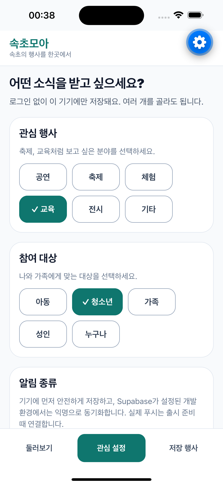
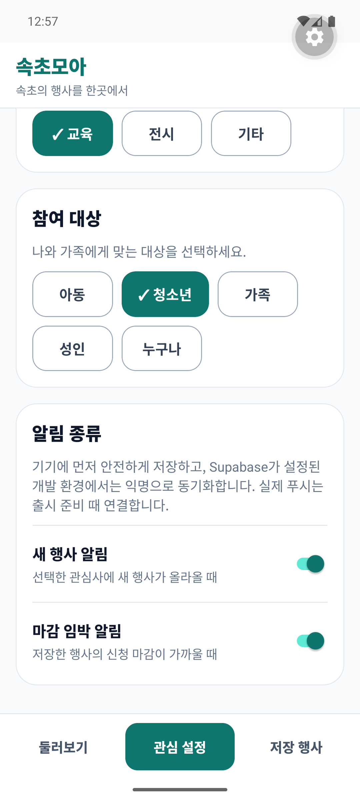
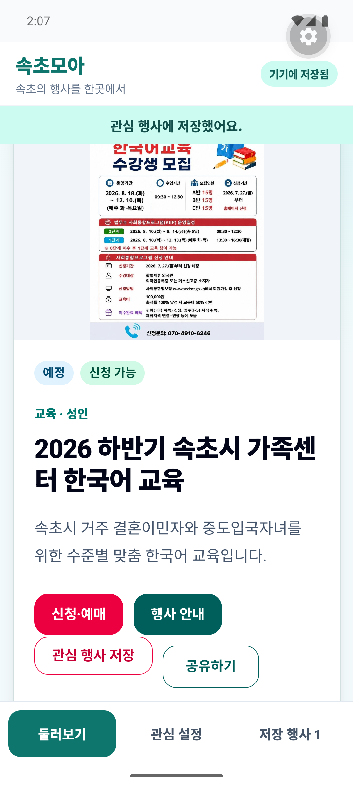
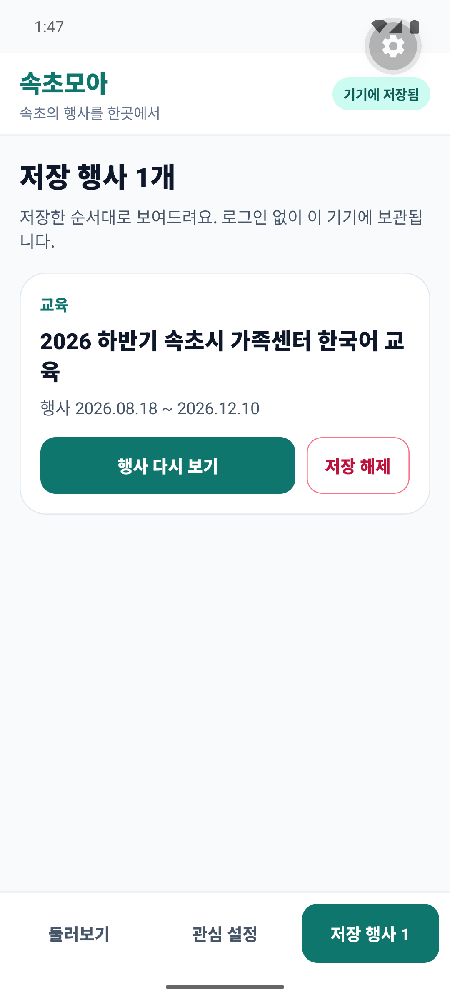
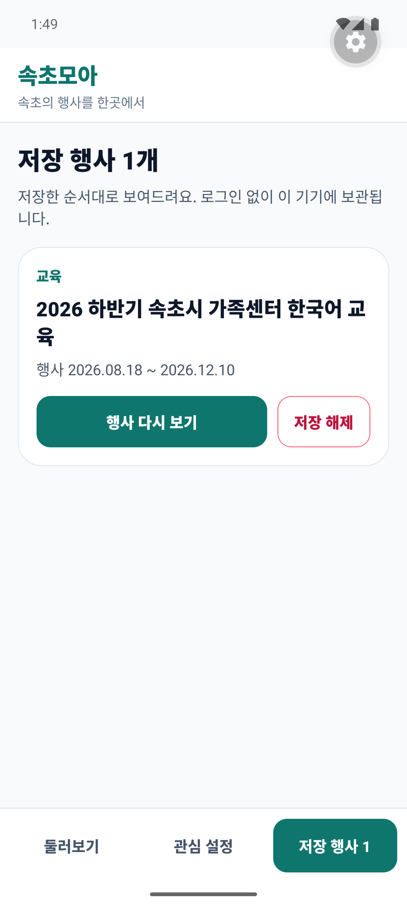

# 속초모아 모바일 검증 기록

검증일: 2026-07-27

## 판정

스토어 계정이나 운영 푸시 자격증명 없이 확인할 수 있는 모바일 기반 기능은 현재
개발 기준선을 통과했습니다. iOS에서는 관심사·알림 설정의 로컬 복원을, Android에서는
같은 설정 복원과 WebView 행사 저장의 네이티브 전달·재시작 후 복원을 확인했습니다.
로컬 Supabase 통합 검증도 익명 사용자 간 RLS 격리와 알림 `DRY_RUN`을 통과했습니다.

이는 스토어 출시나 실제 푸시 발송 완료를 뜻하지 않습니다. 서명된 배포 바이너리,
APNs·FCM 자격증명, 실제 provider 발송과 실기기 수신은 출시 단계의 남은 게이트입니다.

## 검증 환경

| 플랫폼 | 환경 | 확인 범위 |
| --- | --- | --- |
| iOS | iPhone 16 Plus Simulator, iOS 18.1, Expo Go | 관심사·알림 선택, Metro reload 뒤 복원 |
| Android | Pixel 6 Emulator, API 35, Expo Go | 관심사·알림 선택, WebView 행사 저장, 앱 강제 종료·재실행 뒤 전체 복원 |
| Backend | 로컬 Supabase와 `dispatch-notifications` `DRY_RUN` | 익명 사용자 RLS 격리, 신규·마감 임박 알림 후보, 외부 요청 0건 |

## iOS 수동 검증

관심 카테고리로 교육·청소년을 선택하고 신규 행사·저장 행사 마감 알림을 켠 뒤,
Metro reload 후에도 네이티브 설정 화면에서 선택 상태가 유지되는 것을 확인했습니다.



iOS에서는 이번 기준선에서 설정 복원까지만 확인했습니다. WebView 행사 저장과 앱
프로세스 종료 뒤 복원은 Android에서 검증했으며, iOS 실기기 검증은 출시 전 별도로
수행해야 합니다.

## Android 수동 검증

Pixel 6 API 35 Emulator에서 다음 흐름을 확인했습니다.

1. 관심 카테고리와 두 알림 토글을 선택
2. 앱 WebView의 행사 상세에서 앱 전용 `관심 행사 저장` 선택
3. 네이티브 저장 목록에 해당 행사가 추가된 것을 확인
4. 앱을 강제 종료하고 다시 실행
5. 관심사·알림 설정과 저장 행사가 모두 유지되는 것을 확인









## WebView 저장 경계 검증

앱 WebView는 User-Agent에 `SokchoMoaApp/1.0`을 덧붙입니다. Next.js 행사 상세는 이
토큰이 있는 요청에만 저장 링크를 서버 렌더링하며, 일반 브라우저에는 링크를 노출하지
않습니다.

저장 링크는 신뢰된 웹 origin의 `/__mobile/save` 경로에 검증 가능한 행사 요약을
담습니다. 네이티브 WebView가 탐색 전에 이 URL을 가로채고 origin·경로·payload를
검증한 뒤 AsyncStorage 저장 흐름으로 넘깁니다. 따라서 해당 경로를 실제 웹 페이지로
제공하거나 외부 origin의 같은 모양 URL을 수락하지 않습니다. 별도의 `postMessage`
저장 입구는 두지 않아 브리지 경계를 이 URL 하나로 제한합니다.

## 로컬 Supabase·알림 검증

다음 명령으로 실제 로컬 Auth·DB·RLS·Edge Function을 함께 검증했습니다.

```bash
pnpm dlx supabase@latest start
pnpm verify:local-mobile-backend
```

검증기는 다음 결과를 확인한 뒤 테스트 데이터를 정리합니다.

- 익명 사용자 두 명 사이의 관심사·저장 행사·기기 토큰 RLS 격리
- 익명 사용자의 관리자 행사 쓰기와 outbox 읽기 차단
- 선택한 관심사에 맞는 신규 행사 알림 후보 한 건
- 저장 행사에 맞는 마감 임박 알림 후보 한 건
- `DRY_RUN` delivery 기록과 provider 외부 요청 0건
- 같은 작업을 다시 실행했을 때 outbox·delivery 중복 방지

## 아직 검증하지 않은 출시 게이트

- 운영 Supabase 프로젝트와 운영 스케줄러
- Expo push token 등록, APNs·FCM 자격증명, 실제 provider 전송
- iOS·Android 실기기 수신, 알림 탭 이동, 종료 상태 알림
- EAS 또는 로컬의 서명된 preview·production 바이너리
- App Store·Google Play 제출, 심사, 단계적 출시와 롤백

재현 명령과 운영 경계는 [모바일 앱 운영 가이드](./mobile-app-runbook.md), 남은 출시
작업은 [모바일 출시 체크리스트](./mobile-release-checklist.md)를 따릅니다.
